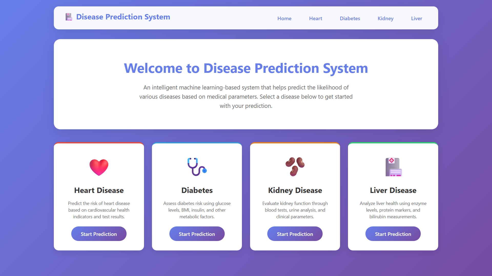
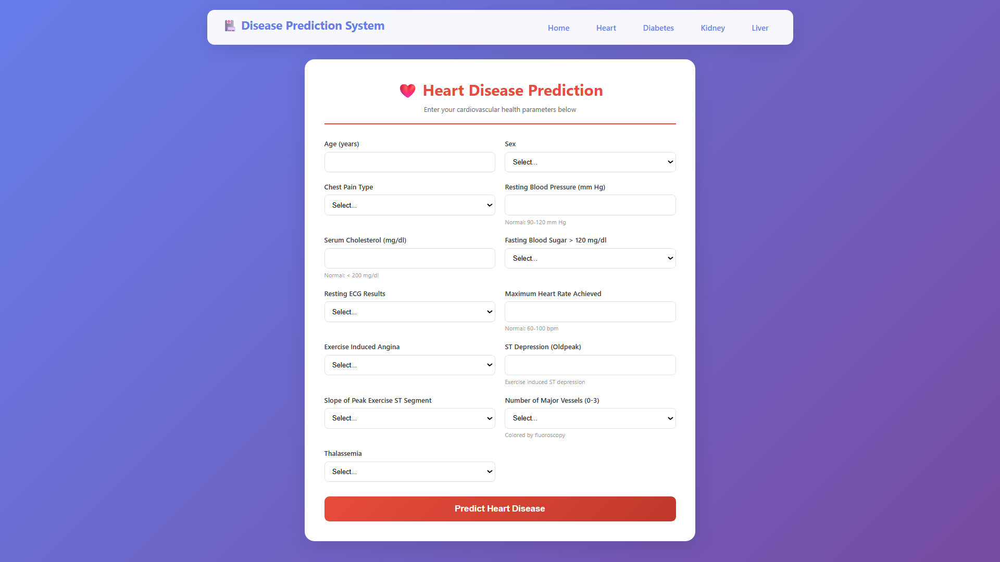
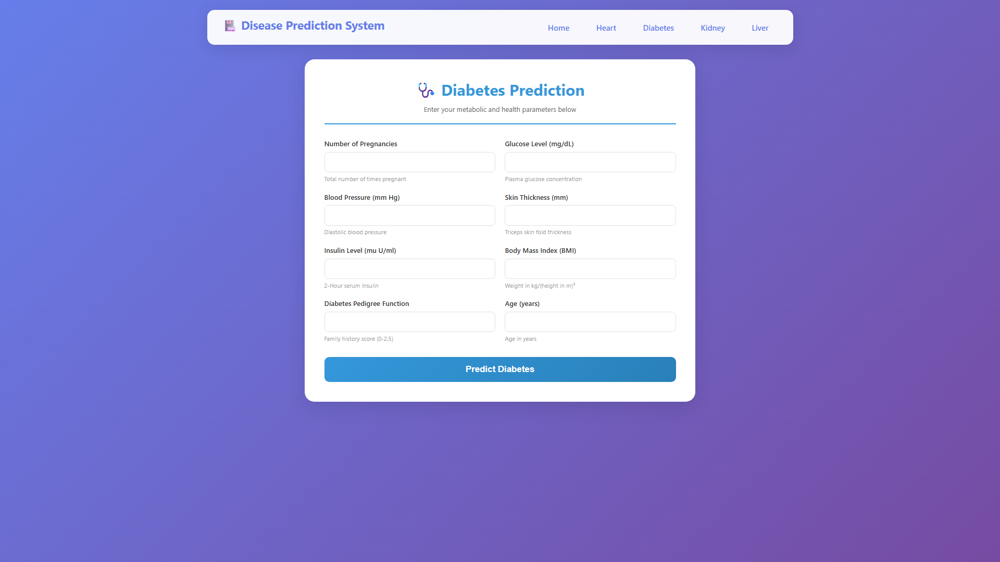
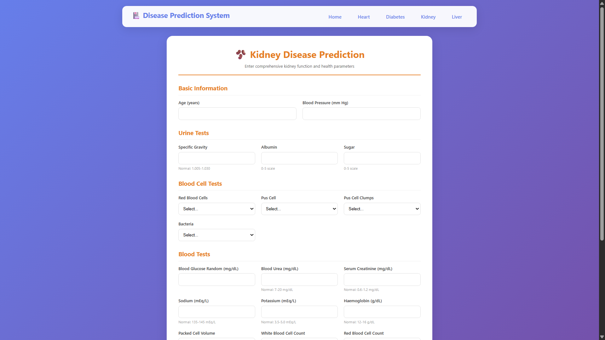
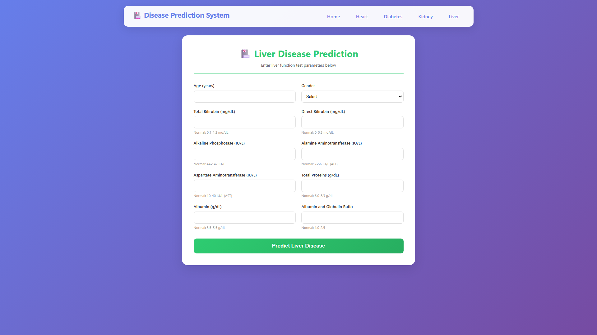
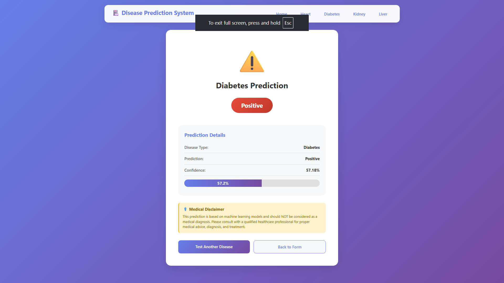

# 🩺 Multi-Disease Prediction System

A **machine learning portfolio project** that combines data analysis, machine learning, and Flask web development to build a web-based system for predicting four health-related conditions:

**Heart Disease · Diabetes · Kidney Disease · Liver Disease**

The project demonstrates an end-to-end workflow — from dataset exploration and preprocessing to model training, model serialization, and integration into a working Flask application.

> ⚠️ **Medical Disclaimer:** This project is for educational and portfolio purposes only. Predictions are not medical diagnoses and should not be used as a substitute for professional medical advice, examination, or treatment.

---

## 🎯 Project Objective

The goal of this project was to build a single web application where users can select a disease, enter the required health parameters, and receive a machine-learning-based prediction.

This project was also designed to demonstrate practical skills relevant to **Data Analyst / Data Science / Machine Learning** roles:

- Python programming
- Data preprocessing
- Exploratory Data Analysis (EDA)
- Feature preparation
- Machine learning
- Model evaluation
- Data visualization
- Model serialization
- Flask application development
- Git & GitHub

---

## 🚀 Key Features

- Four independent disease prediction modules
- Separate input forms for each disease
- Pre-trained machine learning models
- Flask-based web application
- Prediction result page
- Probability output where supported by the trained model
- Disease-specific Jupyter notebooks
- Dataset and trained model files included
- Reproducible Python dependencies through `requirements.txt`

---

## 🖥️ Application Preview

### Home Page



### Heart Disease Prediction



### Diabetes Prediction



### Kidney Disease Prediction



### Liver Disease Prediction



### Prediction Result



---

## 🧠 Solution Workflow

```text
                ┌─────────────────┐
                │     Dataset     │
                └────────┬────────┘
                         ↓
                ┌─────────────────┐
                │ Data Preprocess │
                └────────┬────────┘
                         ↓
                ┌─────────────────┐
                │       EDA       │
                └────────┬────────┘
                         ↓
                ┌─────────────────┐
                │ Feature Prepare │
                └────────┬────────┘
                         ↓
                ┌─────────────────┐
                │ Model Training  │
                └────────┬────────┘
                         ↓
                ┌─────────────────┐
                │ Model Evaluation│
                └────────┬────────┘
                         ↓
                ┌─────────────────┐
                │ Save Model .pkl │
                └────────┬────────┘
                         ↓
                ┌─────────────────┐
                │ Flask Web App   │
                └────────┬────────┘
                         ↓
                ┌─────────────────┐
                │   User Input    │
                └────────┬────────┘
                         ↓
                ┌─────────────────┐
                │    Prediction   │
                └─────────────────┘
```

---

## 📂 Project Structure

```text
multi-disease-prediction-system/
│
├── README.md
├── .gitignore
├── app.py
├── requirements.txt
│
├── datasets/
│   ├── diabetes.csv
│   ├── heart.csv
│   ├── kidney_disease.csv
│   └── liver_disease.csv
│
├── models/
│   ├── diabetes_model.pkl
│   ├── heart_model.pkl
│   ├── kidney_model.pkl
│   └── liver_model.pkl
│
├── notebooks/
│   ├── diabetes.ipynb
│   ├── heart.ipynb
│   ├── kidney.ipynb
│   └── liver.ipynb
│
├── screenshots/
│   ├── home.png
│   ├── heart.png
│   ├── diabetes.png
│   ├── kidney.png
│   ├── liver.png
│   └── result.png
│
└── templates/
    ├── base.html
    ├── index.html
    ├── diabetes.html
    ├── heart.html
    ├── kidney.html
    ├── liver.html
    └── result.html
```

---

## 🛠️ Tech Stack

| Category | Technologies |
|---|---|
| Language | Python 3.12 |
| Web Framework | Flask |
| Data Analysis | Pandas, NumPy |
| Machine Learning | Scikit-learn, XGBoost |
| Visualization | Seaborn |
| Model Serialization | Pickle / Joblib |
| Development | Jupyter Notebook, VS Code |
| Version Control | Git, GitHub |
| Frontend | HTML, CSS |

### Dependency Version

The project uses:

```text
scikit-learn==1.5.1
```

The version is pinned to maintain compatibility with the serialized models included in the repository.

---

## 📊 Datasets

The project uses datasets distributed through **Kaggle and the UCI Machine Learning Repository**.

### Diabetes

**Pima Indians Diabetes Database**

Features include:

- Pregnancies
- Glucose
- Blood Pressure
- Skin Thickness
- Insulin
- BMI
- Diabetes Pedigree Function
- Age
- Outcome

### Heart Disease

The project uses a 1,025-record heart disease CSV containing 14 columns, including patient attributes and the target variable.

### Kidney Disease

**Chronic Kidney Disease Dataset**

Original source:

UCI Machine Learning Repository  
https://archive.ics.uci.edu/dataset/336/chronic+kidney+disease

### Liver Disease

**Indian Liver Patient Dataset (ILPD)**

Original source:

UCI Machine Learning Repository  
https://archive.ics.uci.edu/dataset/225/ilpd+indian+liver+patient+dataset

The UCI listing identifies the ILPD dataset under **CC BY 4.0**.

> Dataset-specific terms and attribution requirements should be checked before redistributing or reusing the datasets.

---

## 📓 Machine Learning Notebooks

The `notebooks/` directory contains the individual model-development notebooks:

| Notebook | Purpose |
|---|---|
| `diabetes.ipynb` | Diabetes data analysis and model development |
| `heart.ipynb` | Heart disease data analysis and model development |
| `kidney.ipynb` | Kidney disease data analysis and model development |
| `liver.ipynb` | Liver disease data analysis and model development |

The notebooks provide the data science side of the project, while `app.py` connects the trained models to the Flask interface.

---

## 💻 Run the Project Locally

### 1. Clone the repository

```bash
git clone https://github.com/mrsahilverma/multi-disease-prediction-system.git
cd multi-disease-prediction-system
```

### 2. Create the Conda environment

```bash
conda create -n multi_disease python=3.12
```

Activate it:

```bash
conda activate multi_disease
```

### 3. Install dependencies

```bash
pip install -r requirements.txt
```

### 4. Run the Flask application

```bash
python app.py
```

Open the local Flask URL shown in the terminal, typically:

```text
http://127.0.0.1:5000
```

---

## 🔍 Prediction Output

The application returns a prediction result for the selected disease.

Where supported by the trained model, the application also displays a value obtained through `predict_proba()`.

**Important:** This probability/confidence output is a model output for the supplied input. It is **not model accuracy and should not be interpreted as medical certainty**.

---

## 📈 Model Evaluation

Model development and evaluation are performed inside the individual notebooks.

The repository does not list unsupported or invented performance numbers. Evaluation metrics should be taken directly from the corresponding notebook/model experiments.

---

## 💡 What This Project Demonstrates

### Data Analysis

- Dataset loading
- Data cleaning and preprocessing
- Exploratory data analysis
- Feature preparation
- Data visualization

### Machine Learning

- Model training
- Model evaluation
- Prediction
- Probability estimation
- Model serialization

### Application Development

- Flask routing
- HTML templates
- User input handling
- Model integration
- Prediction result rendering

### Development Workflow

- Jupyter Notebook
- VS Code
- Conda environment
- Git version control
- GitHub repository management

---

## 🔮 Future Improvements

- [ ] Add stronger input validation
- [ ] Add automated tests
- [ ] Improve model comparison and tuning
- [ ] Add model explainability
- [ ] Improve UI/UX
- [ ] Add API endpoints
- [ ] Add cloud deployment
- [ ] Add additional prediction modules
- [ ] Improve handling of missing/invalid inputs

---

## 👨‍💻 About the Author

**Sahil Verma**

MCA graduate focused on **Data Analytics, Data Science, Python, SQL, Power BI, Machine Learning, and AI-enabled analytics**.

### Connect

- **GitHub:** https://github.com/mrsahilverma
- **LinkedIn:** https://www.linkedin.com/in/mrsahilverma/

---

## ⭐ Repository

If you are exploring this project for learning, data science, or machine learning development, feel free to explore the notebooks, datasets, models, and Flask application.

---

## ⚖️ Disclaimer

This application is an educational machine learning project. It is not a clinical decision-support system and should not be used to diagnose, treat, or make medical decisions about any person.
